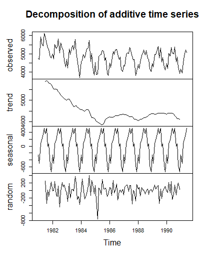
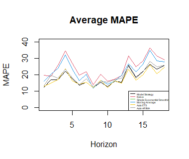

# Comprehensive Time Series Forecasting with the M3 Competition Dataset

This repository presents a comprehensive business analytics report on time series forecasting, utilizing various statistical and machine learning models to analyze and predict future trends. The analysis covers exploratory data insights, forecasting models, evaluation metrics, and actionable business insights.

---

## Dataset Overview

The dataset used for this analysis is sourced from the M3 competition dataset, containing various time series data across industries like finance, retail, and manufacturing. Each time series includes:
- **In-sample Data (`x`)**: Historical observations used for model training.
- **Out-of-sample Data (`xx`)**: Future observations used to evaluate forecast accuracy.

---

### Key Characteristics of the Dataset

#### 1. Time Series Distribution
The dataset comprises **3003 time series** distributed across six domains:
- **Micro**: Small-scale business data.
- **Industry**: Manufacturing and production.
- **Finance**: Economic and stock market indicators.
- **Demographics**: Population, births, deaths, etc.
- **Macroeconomics**: National and global economic metrics.
- **Others**: Miscellaneous series not classified in the above.

---

#### 2. Time Frequencies
The dataset includes time series of different frequencies:
- **Yearly (645 series)**: Data recorded annually.
- **Quarterly (756 series)**: Data recorded every quarter.
- **Monthly (1428 series)**: Data recorded every month.
- **Other frequencies**: Weekly, daily, and hourly series (a smaller portion).

---

# Time Series Forecasting with ARIMA and ETS Models

## Manual Forecasting

### Data Exploration
Manual forecasting focuses on **series 1910**, which records the total shipment of glass containers from 1981 to 1992.

- The seasonal plot shows clear monthly seasonality:

- The decomposition highlights the trend, seasonality, and residuals:

---

### Forecasting Results
- **ARIMA Forecast**: Robust for medium- to long-term predictions:

- **ETS Forecast**: Excellent for short-term accuracy:

---

## Batch Forecasting

### Strategy Overview
Batch forecasting applies automated modeling to **100 monthly time series** extracted from the M3 dataset. Each series is analyzed independently to select the most suitable model (ARIMA or ETS).

---

### Performance Evaluation
The models' performance is evaluated using error metrics like MAPE and MASE.

- **MAPE Results**:

- **MASE Results**:

---

### Results Summary
- ETS and ARIMA delivered comparable performance for short-term horizons.
- For longer-term predictions, ARIMA demonstrated more stable accuracy.

